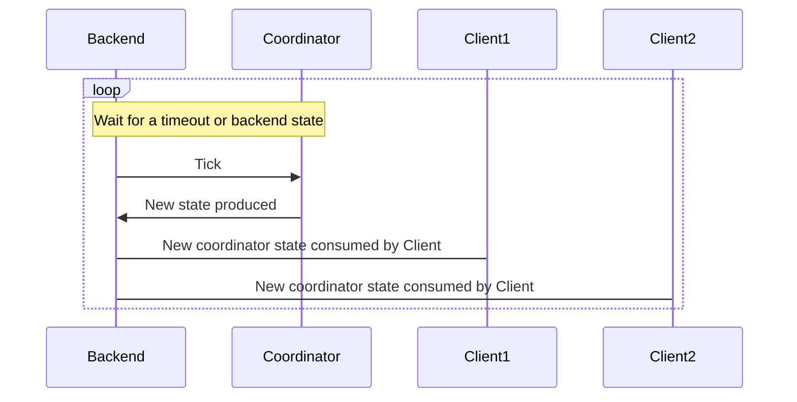
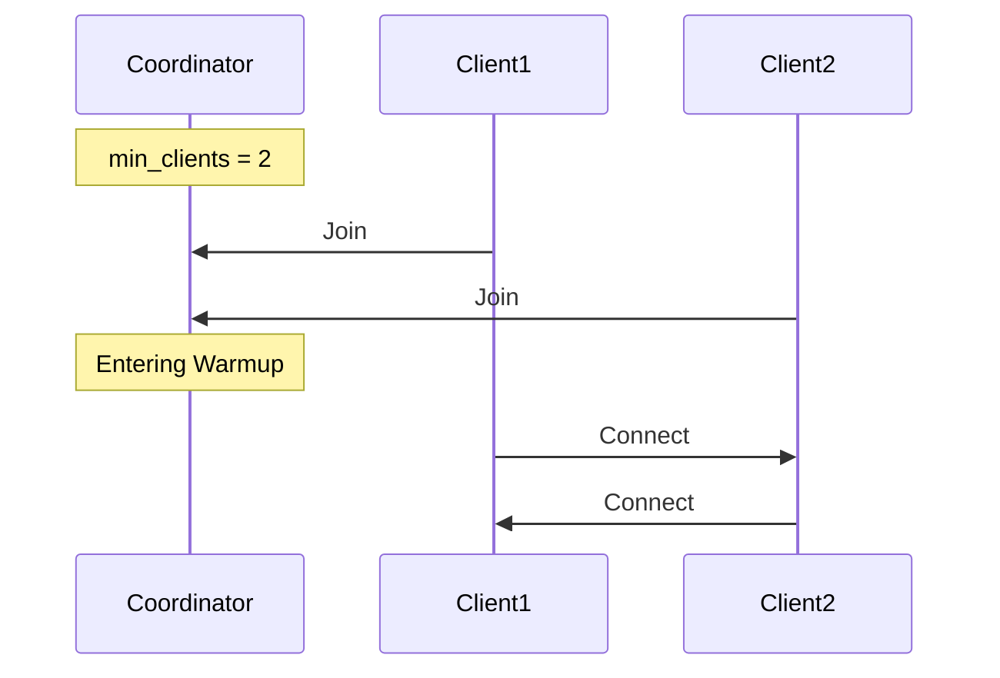
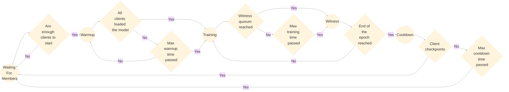
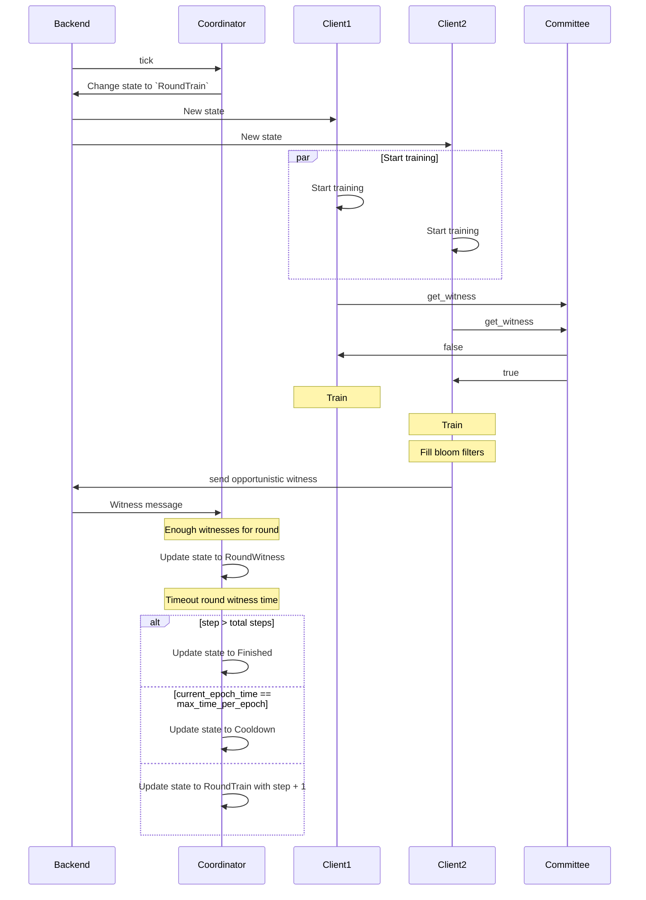
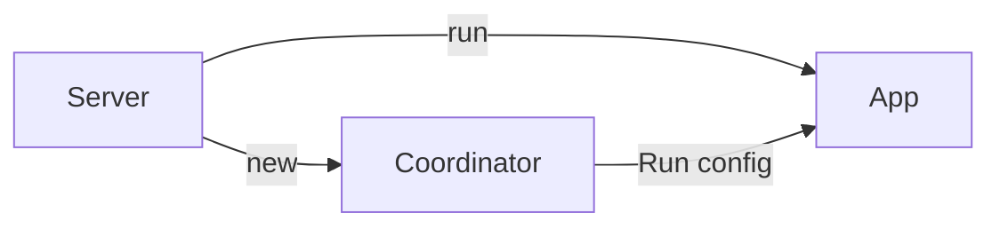
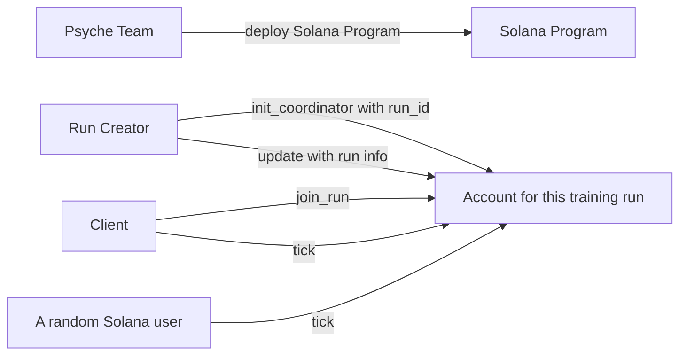
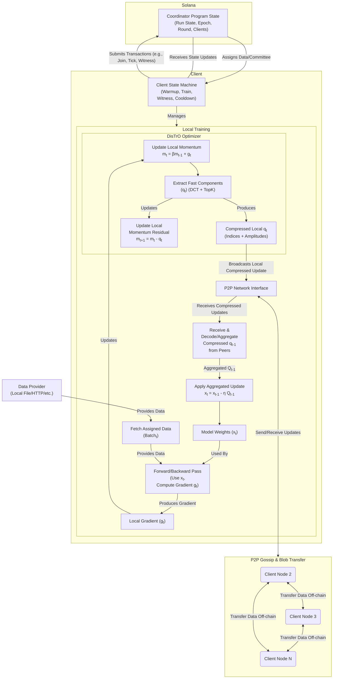

# General Workflow

## Client

A client is an active participant responsible for executing the training tasks within a run. It handles assigned data batches for training, generates commitments, and participates in the witness process when elected to validate the work of its peers. Each client maintains its own state synchronized with the Coordinator.

## Coordinator

The Coordinator stores metadata about the training run's state and a list of participants.

It handles the transition between each Phase of a Round, and provides a random seed that's used to determine data assignments, witnesses, and more.

It's responsible for providing a point of synchronization for all clients within a run.

## Ticks (State Transitions)

The coordinator behaves like a state machine, moving from one state to another, with each state transition having specific requirements.

When certain events occur or time-based conditions are met, the Coordinator can be "ticked" forwards to transition from one Phase to another Phase.

In this case the backend is just the layer of the Clients that communicates with the Coordinator, depending on the run nature it will communicate with Solana blockchain or just via TCP to the coordinator.

### Beginning an Epoch (state: WaitingForMembers)

The Coordinator begins in the `WaitingForMembers` phase, with no clients connected.

Whatever backend you're running the Coordinator in should accept pending clients to be added to upcoming Epochs.

When inside the `WaitingForMembers` phase, your backend will pass new clients to the Coordinator until a configured `min_clients` threshold is met, at which point the coordinator's `tick` will transition it to the `Warmup` phase.

### Model Loading (state: Warmup)

This phase is designed to let all clients download the model & load it onto their GPUs.

If a client has dropped whilst waiting for the warmup time to elapse, the Backend then removes the client from the Coordinator's clients list and in case the number of clients falls below `min_clients`, the Coordinator goes back to the `WaitingForMembers` phase and wait for more clients to join.

There's two different ways the coordinator will transition to the `RoundTrain` phase:

- If all the participant clients have finished loading the model and are ready to start training they send a specific message to the Coordinator and if the Coordinator receives this message from all clients, it transitions to the `RoundTrain` phase earlier.
- If the `Warmup` max time passes the Coordinator will transition to the `RoundTrain` phase even if not all clients have finished loading the model. This max time is configurable and can be set in the configuration file.

The Backend will watch for the state transition and all clients will be notified of this new `Training` Coordinator state.

### Training (state: RoundTrain)

In this phase, the Coordinator provides a random seed, each client can use this seed, alongside the current round index and epoch index to determine which indices of the whole training batch they will train on. Basically every client will train on a different subset of the training data.

As clients complete their training, they send their results to all other clients, including the Witnesses. The witnesses will each send a **witness proof** to the Coordinator, building towards a **witness quorum**.

A witness proof contains a bloom filter describing which pieces of data the witness received training results for, and which clients did that work. Elected witnesses are responsible for creating these witness proofs and and sending them to the Coordinator.

The witnesses for each round are chosen randomly from all the clients, using the same random seed as for data assignments. A witness will attempt to send an **opportunistic witness** message once it's seen a received a training result for every single batch in the current round. That message lets the Coordinator know that it can transition to the _Witness_ phase without waiting all the training time.

The Coordinator advances the run from the _Training_ phase to the _Witness_ phase in one of two ways:

- If enough witnesses observe all results and reach a **witness quorum** for the round, they notify the Coordinator that it is safe to advance. This process, named **opportunistic witnessing**, accelerates the transition to the _Witness_ phase, rather than having to wait a fixed time for training results.
- If witnesses do not receive all required results from other clients before the maximum time specified for the _Training_ phase, the Coordinator will nonetheless transition to the _Witness_ phase after the maximum _Training_ time elapses.

The Backend will watch for the state transition and all clients will be notified of this new `Witness` Coordinator state.

### Witness phase (state: RoundWitness)

This phase exists to give the witnesses an opportunity to send their proofs to the Coordinator in the event that they have not received enough training results from other clients to have reached the quorum and send their proofs opportunistically.

There is also brief slack period for non-witness nodes to catch up by downloading any remaining results they might have not received.

When the _Witness_ phase finishes only reaching the maximum witness time, the Coordinator transitions from _Witness_ to the _Training_ phase again in most of the cases, it only transitions to a new state known as _Cooldown_ in the following three cases:

- If we are in the last round of the epoch.
- If the clients have dropped to less than the minimum required by the config.
- If the number of witnesses for the round is less than the quorum specified by the config.

Any clients that have failed [health checks](#health-checks) will also be removed from the current epoch.

### Cooldown phase (state: Cooldown)

The **Cooldown** phase is the last phase of an epoch. At this point, clients begin creating a new checkpoint of the model. This means saving the current state of the model to external storage, such as Hugging Face or a bucket in Google Cloud Storage (GCS).

At the beginning of this state, the run elects a subset of clients that will be designated as **checkpointers**. All clients are potential checkpointers: one third of the total clients in the run will be elected pseudo-randomly at this stage. If a client is elected, it will start uploading the model state to the storage declared in the run configuration by the run owner.

The client that finishes uploading the model sends a transaction to the coordinator, called the **opportunistic cooldown**, indicating that the entire model was uploaded successfully.

There are two ways the coordinator can transition from this state to the next one:

- As soon as the first opportunistic cooldown transaction arrives, the coordinator moves to the next state and cancels all upload tasks from the remaining clients, since it already knows that at least one checkpointer has uploaded the complete model correctly.
- If no transaction is received, there is a maximum cooldown time defined in the run configuration. If this time is reached, the coordinator will move to the next state even if no new checkpoint was produced.

When the _Cooldown_ phase begins, the coordinator also resets the current model checkpoint state to `Checkpoint::P2P`, indicating that new joiners should download the latest copy of the model from other participants rather than from the usual checkpoint storage.

Upon exiting the _Cooldown_ phase, the coordinator transitions to the next epoch, saving the previous epoch state and moving back to the _WaitingForMembers_ phase. All clients that participated in the previous epoch automatically join the new epoch unless they exit manually.

### It all comes together

Here's is an overview of how the state of the run can change depending on the situation:

And this is how it fits with real the real clients and how they interact in each of the stages. The committee in this case is the structure that contains all the witness data for the round.

## Health checks

Each client should repeatedly send health checks to the coordinator. Clients are assigned a score determined by the Coordinator using the `trainer_healthy_score_by_witnesses` method. This score increases as a client sends the required data to be added to the participants' bloom filters, allowing the Coordinator to confirm that the client is actively participating in the training.

A client also sends a list of other clients it considers unhealthy to the server using the `HealthCheck` message. The Coordinator processes this information to determine whether those clients are healthy. Clients deemed inactive or non-participatory are marked for removal in the next round.

## Centralized Backend

In this Backend, the Coordinator is owned and ticked forwards by a Server that communicates via clients over TCP.

The Server's Coordinator is initially configured in the main file of the server.
It's loaded using the configuration a specific configuration file `state.toml`

The Server uses some parts of the Coordinator configuration, like the data server configuration, if enabled, to boot up all the functionality it needs.

When a new client joins the run it has to communicate the `run_id` that it wants to join, to ensure the client's joining the correct run. After processing the join message, the client is added to a pending clients list, and runs the Coordinator's tick function to potentially add the client into the run.

When a tick condition is met, the Server ticks the Coordinator forwards, then broadcasts the Coordinator's new state to all connected clients.

## Decentralized Backend

In this Backend, the Coordinator is an account associated with a Solana Program, and ticked forwards by a `tick` method that can be called by anyone.

A training run can be created by calling the `init_coordinator` method in the Coordinator program, and subsequently information about the model to be trained can be set by calling the `update` method.

For a new client to join the run, it must call the `join_run` method in the Coordinator program and pass the `run_id` for the run it intends to join. After the Solan Program processes the join message, the client is added to a pending clients list, and the Program runs the Coordinator's tick function to potentially add the client into the run.

When a tick condition is met, anybody using Solana can tick the Coordinator forwards by calling the `tick` method (clients in a Run will do this automatically). This new state is then read via an RPC subscription on each Client, progressing through the regular state machine.

### Decentralized training flow

Here's a more detailed diagram including mostly every component involved in the Psyche training flow with a little more implementation details:

