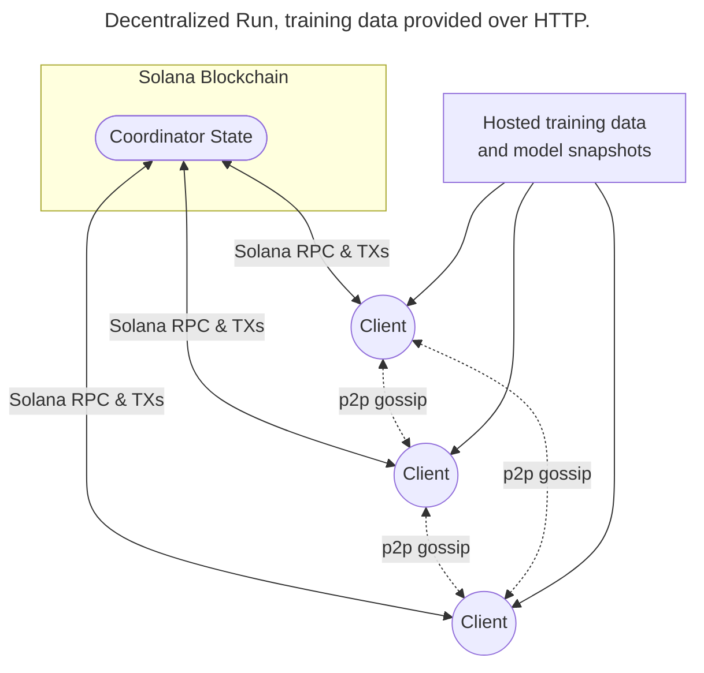
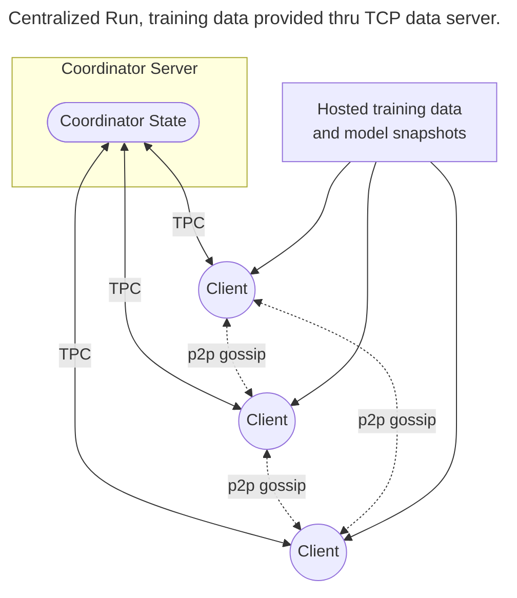
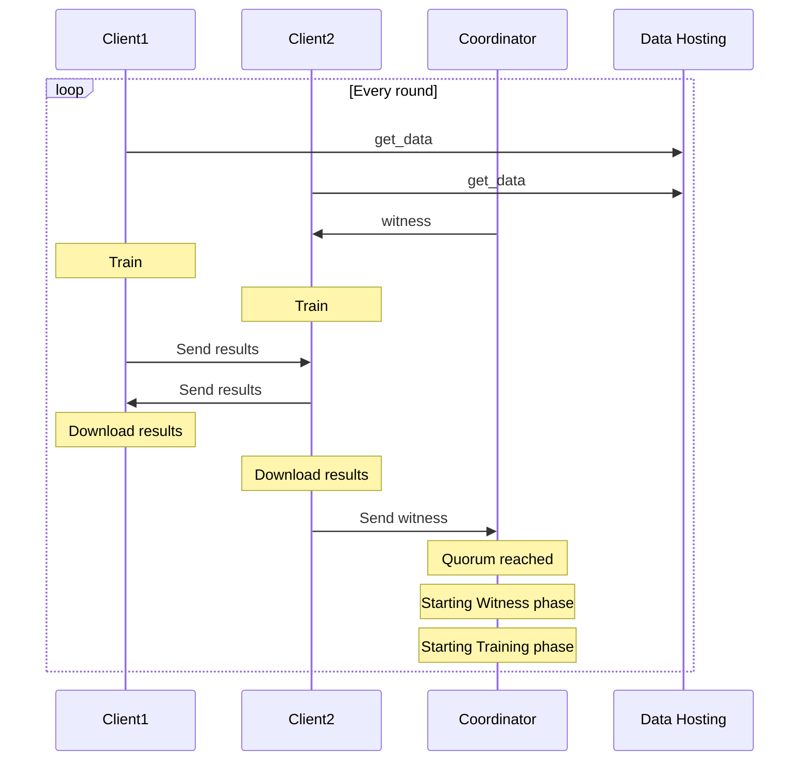

# Psyche In Depth

The core system is composed of three main actors:

- **Coordinator**: Serves as a source of truth for global state available to all clients in a given training run. Each run has one coordinator that oversees the entire process. The coordinator is implemented as both a program running on the Solana Blockchain and as a regular TCP server.

- **Client**: A user participating in a training run. Clients receive the model to be trained and a specific dataset for that run. They send information to the coordinator to progress the training run and use a peer-to-peer network to share their results at each training step with other clients.

- **[Data Provider](./data-provider.md)**: Each run requires training data. This data could be served by the Psyche Data Provider server, over HTTP, or loaded from local copies of a dataset.

Psyche provides two different implementations of the network, one for [decentralized](./general-workflow.md#decentralized-backend) runs that use the Solana Blockchain with the coordinator running in it and another for [centralized](./general-workflow.md#centralized-backend) runs that use the Coordinator as a regular TCP server and mostly is mostly used to test local runs and as a dev oriented tool.

## Sample topologies

## What constitutes a training run?

The training process for a given model is divided into small steps that incrementally train the model in a coordinated manner. A training run is divided into **epochs**, where clients can join and leave the run, and **epochs** are further divided into **rounds** that will be further divided into **steps**, where the model is incrementally trained.

During a training run, clients primarily perform three tasks:

- **Training**: Train the model using an assigned subset of the data.
- **Witnessing**: Verify the liveness and correctness of other participants.
- **Verifying**: Recompute and compare training results to identify and punish malicious participants.

These three phases constitute a **round** of training and will be looping until the **epoch** is completed.

## Waiting for Members & Warmup

At the start of an **epoch**, all clients have a window of time to join the run by requesting to be added by coordinator, and then connecting to the other participating clients. This state will be known as the _Waiting for Members_ phase.

Once a minimum threshold of clients has been met, the run will transition to the _Warmup_ phase and begin a countdown to allow connected clients to update their copy of the model. To obtain a copy of the model, the Coordinator will either direct clients to a checkpoint uploaded somewhere like HuggingFace or Google Cloud Storage and they will have to download it from there or direct clients to [download the model from other clients](./model-sharing.md) via the p2p network. In the first epoch, all clients will download the model from the external storage and after that every new epoch, clients will download the model from other clients via the p2p network.

After the _Warmup_ phase ends, it will enter the _Training_ phase.

## Training

At the beginning of a **round**, either after the _Warmup_ or _Witness_ phase ends, clients are assigned specific tasks that require them to train the model on a portion of the data.

The coordinator contains information that uniquely assigns pieces of training data to clients based on the current **round**.

If clients have already been training (i.e., it is not the first round of the epoch), they will apply the results from the previous round, then retrieve the data sample they need for the current round.

After completing the training on their assigned data, each client emits a p2p broadcast to all other clients containing their training results and a cryptographic commitment that binds them to those results.

As the training results are received from other clients, they are downloaded to be later incorporated into the current copy of the model of each client.

## Witnessing

At the start of each round, one or more clients are randomly selected as witnesses. The number of witnesses can be configured. Witnesses train the model as usual, but also build bloom filters that track which nodes they have received training results from, signifying that they are actively participating and providing valid results.

These bloom filters are sent to the coordinator, which then combines them into a provable consensus of which results to apply to the model.

Once a witness quorum is reached, the coordinator advances to the _Training_ phase to allow all clients a brief window to download every training result of the previous round, clients are assigned new data, and the process repeats. After a fixed amount of time, a _Cooldown_ round occurs, marking the end of an **epoch**. At this state, one third of the clients are randomly selected as checkpointers and all of them starts uploading the state of the model to an external storage. There's a maximum amount of time for staying in this state, this time is configurable in the run creation process that we'll explore in the other sections.

## The witness/train loop visualized

Here's a high-level overview of the process.

There are additional implementation details, but this captures the overall flow of a single Round in an Epoch:

## Glossary

For a list of common terms within the project along with definitions, please refer to the [glossary](./glossary.md)
